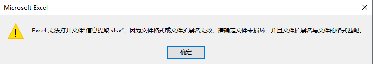

## 文件说明

### extract.py

用于提取文件中的信息，生成与 `shuffle.py` 所需格式的文件，首先按照文件路径在`input_file`除指定文件的路径，**包含后缀名**。然后按照原始文件中的表头，修改 `headers`中的内容，运行该文件后从原始文件中提取`headers`中设置的对应列，请务必确保表头中严格包含`headers`中的关键字，**例如`姓名`和`名字`不等价。**


### shuffle.py

这个文件用来打乱选手进行分组，依赖于 `extract.py` 的生成文件，使用时请先按照文件路径在 `input_file` 中指定第一步生成的文件的路径，**包含后缀名**。另外请按照上述 `extract.py` 文件相关要求 设置 `headers`中的内容，要求同上。


## 运行环境

1. 请安装`python3`，并检查版本

   ```bash
   python --version # 推荐使用 python 3.8
   ```

2. 代码依赖`xlrd`和`xlwt`两个包，安装命令如下

   ```sh
   pip install xlrd==1.2.0 xlwt==1.3.0 # 其他版本可能不支持 xlsx 格式文件，可以尝试将文件后缀改为`xls`
   ```


仅在上述提到版本及依赖中通过测试，若使用其他版本请自行解决。

运行

```sh
python extract.py
python shuffle.py
```


## 其他问题
### Excel 无法打开输出的 `xlsx` 文件



【解决方式】：请将需要打开的文件的拓展名改为 `xls` 。

【注意】：若修改拓展名后，请根据实际情况修改文件中的 `input_file` 处的值。
